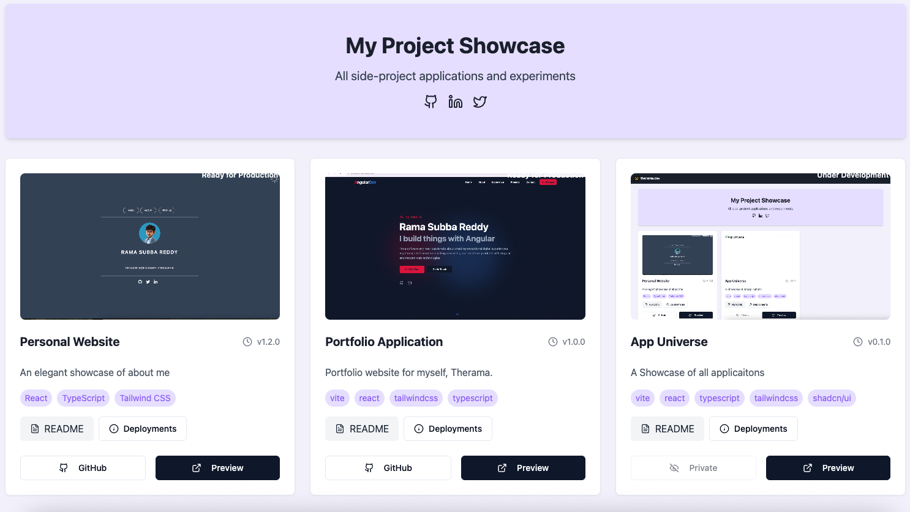

# Apps Portfolio Platform

A modern, responsive portfolio platform showcasing various applications and projects. Built with React, TypeScript, and Tailwind CSS, deployed on AWS infrastructure.



## 🚀 Features

- **Project Showcase**: Display all your applications with detailed information
- **Live Status Updates**: Real-time project status tracking
- **Deployment History**: Track all deployments with detailed information
- **README Integration**: View project READMEs directly in the interface
- **Responsive Design**: Works seamlessly on desktop and mobile devices
- **Dark/Light Mode**: Supports system theme preferences

## 🛠 Tech Stack

- **Frontend Framework**: React with TypeScript
- **Styling**: Tailwind CSS + shadcn/ui
- **Build Tool**: Vite
- **Deployment**: AWS (S3, CloudFront, CloudFlare)
- **CI/CD**: GitHub Actions
- **Database**: Supabase
- **Analytics**: Google Analytics

## 📦 Installation

```bash
# Clone the repository
git clone https://github.com/rmaeondev/apps.therama.dev.git

# Navigate to project directory
cd apps.therama.dev

# Install dependencies
npm install

# Start development server
npm run dev
```

## 🔧 Environment Variables

Create a `.env` file in the root directory with the following variables:

```env
VITE_API_URL=your_api_url
VITE_SUPABASE_URL=your_supabase_url
VITE_SUPABASE_ANON_KEY=your_supabase_key
```

## 🚀 Deployment

The application uses GitHub Actions for automated deployments. The workflow:

1. Builds the application
2. Deploys to AWS S3
3. Invalidates CloudFront cache
4. Updates project status
5. Logs deployment information

### Manual Deployment
```bash
# Build the application
npm run build

# Deploy to AWS (requires AWS CLI configuration)
aws s3 sync ./dist s3://your-bucket-name --delete
```

## 🔄 CI/CD Pipeline

The project includes a comprehensive GitHub Actions workflow that:

- Runs on push to main branch
- Performs clean npm installation
- Builds the application
- Deploys to AWS S3
- Invalidates CloudFront cache
- Logs deployment status
- Updates project version

## 🤝 Contributing

1. Fork the repository
2. Create your feature branch (`git checkout -b feature/amazing-feature`)
3. Commit your changes (`git commit -m 'Add amazing feature'`)
4. Push to the branch (`git push origin feature/amazing-feature`)
5. Open a Pull Request

## 📝 License

This project is licensed under the MIT License - see the [LICENSE](LICENSE) file for details.

## 👥 Contact

Your Name - [@yourtwitter](https://twitter.com/yourtwitter)
Project Link: [https://apps.therama.dev](https://apps.therama.dev)

## 🙏 Acknowledgments

- [shadcn/ui](https://ui.shadcn.com/) for the beautiful UI components
- [Tailwind CSS](https://tailwindcss.com/) for the utility-first CSS framework
- [Vite](https://vitejs.dev/) for the blazing fast build tool
